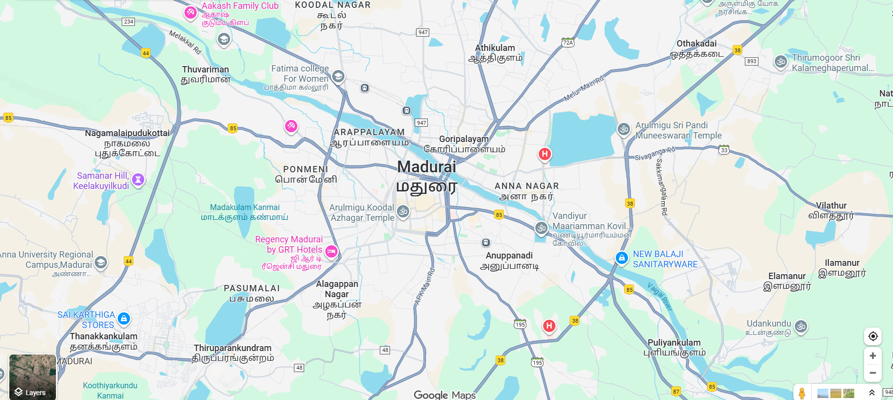
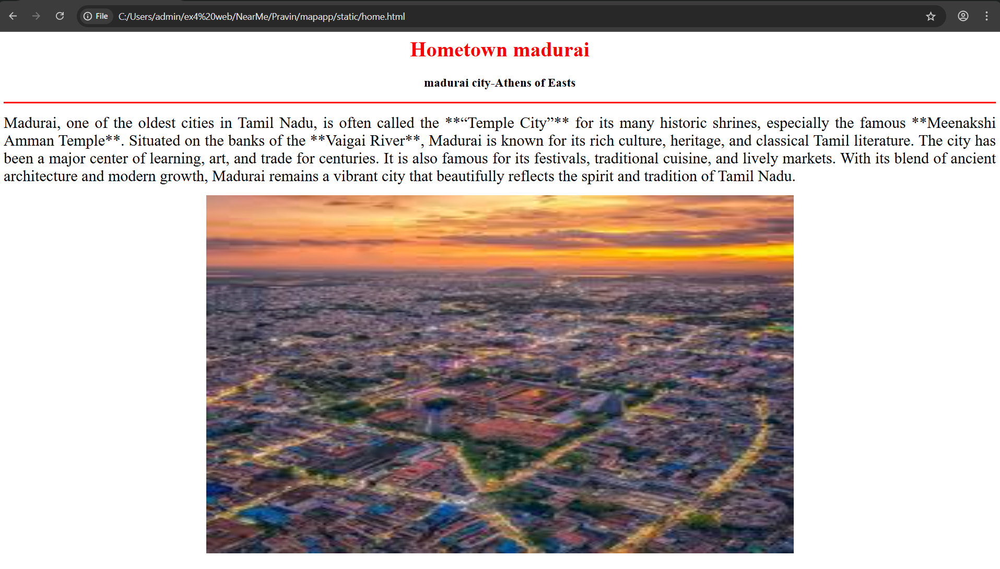
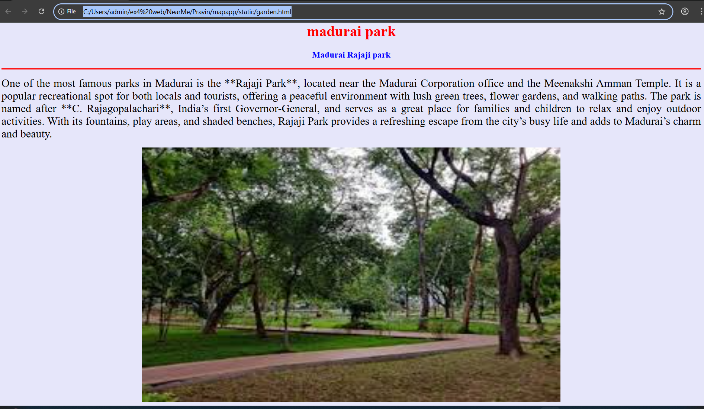
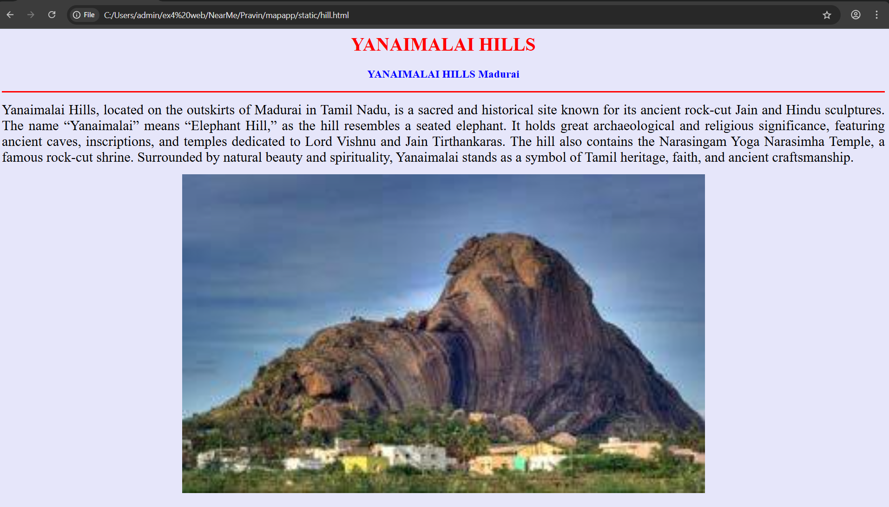
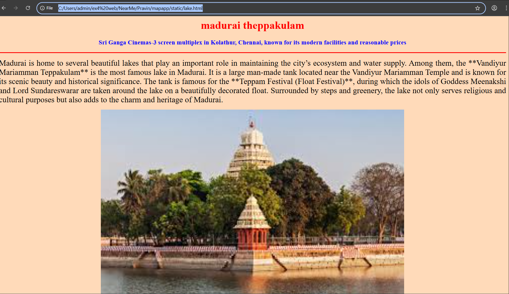
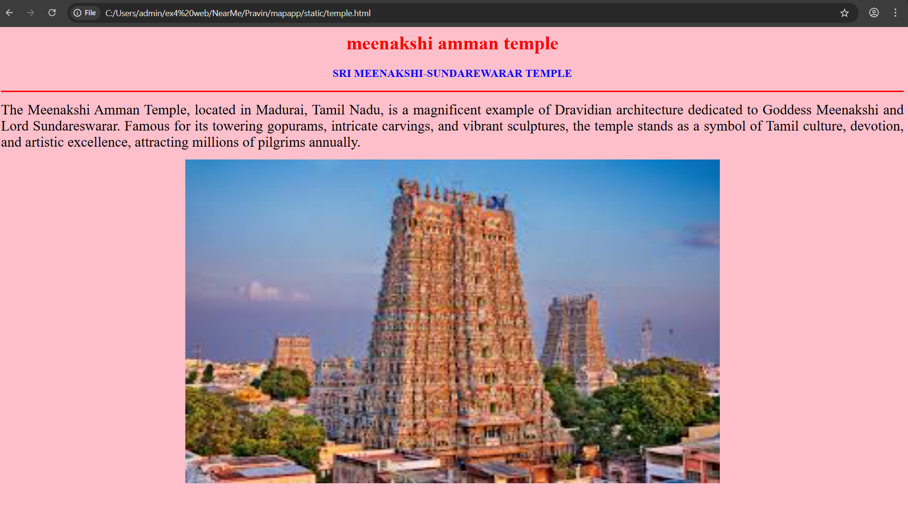

# Ex04 Places Around Me
## Date: 30.10.2025

## AIM
To develop a website to display details about the places around my house.

## DESIGN STEPS

### STEP 1
Create a Django admin interface.

### STEP 2
Download your city map from Google.

### STEP 3
Using ```<map>``` tag name the map.

### STEP 4
Create clickable regions in the image using ```<area>``` tag.

### STEP 5
Write HTML programs for all the regions identified.

### STEP 6
Execute the programs and publish them.

## CODE
```
map.html

<html>
<head>
<title>My City</title>
</head>
<body>
<h1 align="center">
<font color="red"><b>Madurai</b></font> 
</h1>
<h3 align="center">
<font color="blue"><b>PRAVIN SM (25001962)</b></font>
</h3>
<center>

<map name="MyCity">
<area shape="rect" coords="700,250,850,400" href="home.html" title="My Home Town">
<area shape="circle" coords="570,230,45" href="temple.html" title="meenakshi amman temple">
<area shape="rect" coords="640,200,30" href="lake.html" title="Arrappalayam">
<area shape="rect" coords="1120,360,20" href="garden.html" title="park">
<area shape="rect" coords="950,120,1100,140" href="hill.html" title="othakdai">
</map>
</center>
</body>
</html>

home.html

<html>
<head>
<title>my home town</title>
</head>
<body bgcolor="white">
<h1 align="center">
<font color="red"><b>Hometown madurai</b></font>
</h1>
<h3 align="center">
<font color="black"><b>madurai city-Athens of Easts</b></font>
</h3>
<hr size="3" color="red">
<p align="justify">
<font face="Madurai" size="5">
Madurai, one of the oldest cities in Tamil Nadu, is often called the **“Temple City”** for its many historic shrines, especially the famous **Meenakshi Amman Temple**. Situated on the banks of the **Vaigai River**, Madurai is known for its rich culture, heritage, and classical Tamil literature. The city has been a major center of learning, art, and trade for centuries. It is also famous for its festivals, traditional cuisine, and lively markets. With its blend of ancient architecture and modern growth, Madurai remains a vibrant city that beautifully reflects the spirit and tradition of Tamil Nadu.

</p>
<center>
    
    </center>
</body>
</html

garden.html

<html>
<head>
<title>park</title>
</head>
<body bgcolor="lavender">
<h1 align="center">
<font color="red"><b>madurai park</b></font>
</h1>
<h3 align="center">
<font color="blue"><b>Madurai Rajaji park</b></font>
</h3>
<hr size="3" color="red">
<p align="justify">
<font face="Madurai" size="5">
    One of the most famous parks in Madurai is the **Rajaji Park**, located near the Madurai Corporation office and the Meenakshi Amman Temple. It is a popular recreational spot for both locals and tourists, offering a peaceful environment with lush green trees, flower gardens, and walking paths. The park is named after **C. Rajagopalachari**, India’s first Governor-General, and serves as a great place for families and children to relax and enjoy outdoor activities. With its fountains, play areas, and shaded benches, Rajaji Park provides a refreshing escape from the city’s busy life and adds to Madurai’s charm and beauty.


    
</p>
<center>
    
    </center>
</body>
</html>

hill.html

<html>
<head>
<title>othakdai</title>
</head>
<body bgcolor="lavender">
<h1 align="center">
<font color="red"><b>YANAIMALAI HILLS</b></font>
</h1>
<h3 align="center">
<font color="blue"><b>YANAIMALAI HILLS Madurai</b></font>
</h3>
<hr size="3" color="red">
<p align="justify">
<font face="Madurai" size="5">
    Yanaimalai Hills, located on the outskirts of Madurai in Tamil Nadu, is a sacred and historical site known for its ancient rock-cut Jain and Hindu sculptures. The name “Yanaimalai” means “Elephant Hill,” as the hill resembles a seated elephant. It holds great archaeological and religious significance, featuring ancient caves, inscriptions, and temples dedicated to Lord Vishnu and Jain Tirthankaras. The hill also contains the Narasingam Yoga Narasimha Temple, a famous rock-cut shrine. Surrounded by natural beauty and spirituality, Yanaimalai stands as a symbol of Tamil heritage, faith, and ancient craftsmanship.

    
</p>
<center>
    
    </center>
</body>
</html>

lake.html

<html>
<head>
<title>lake</title>
</head>
<body bgcolor="peachpuff">
<h1 align="center">
<font color="red"><b>madurai theppakulam</b></font>
</h1>
<h3 align="center">
<font color="blue"><b>Sri Ganga Cinemas-3 screen multiplex in Kolathur, Chennai, known for its modern facilities and reasonable prices</b></font>
</h3>
<hr size="3" color="red">
<p align="justify">
<font face="Madurai" size="5">
Madurai is home to several beautiful lakes that play an important role in maintaining the city’s ecosystem and water supply. Among them, the **Vandiyur Mariamman Teppakulam** is the most famous lake in Madurai. It is a large man-made tank located near the Vandiyur Mariamman Temple and is known for its scenic beauty and historical significance. The tank is famous for the **Teppam Festival (Float Festival)**, during which the idols of Goddess Meenakshi and Lord Sundareswarar are taken around the lake on a beautifully decorated float. Surrounded by steps and greenery, the lake not only serves religious and cultural purposes but also adds to the charm and heritage of Madurai.

</p>
<center>
    
    </center>
</body>
</html>

temple.html

<html>
<head>
<title>meenakshi amman temple</title>
</head>
<body bgcolor="pink">
<h1 align="center">
<font color="red"><b>meenakshi amman temple</b></font>
</h1>
<h3 align="center">
<font color="blue"><b>SRI MEENAKSHI-SUNDAREWARAR TEMPLE</b></font>
</h3>
<hr size="3" color="red">
<p align="justify">
<font face="Madurai" size="5">
The Meenakshi Amman Temple, located in Madurai, Tamil Nadu, is a magnificent example of Dravidian architecture dedicated to Goddess Meenakshi and Lord Sundareswarar. Famous for its towering gopurams, intricate carvings, and vibrant sculptures, the temple stands as a symbol of Tamil culture, devotion, and artistic excellence, attracting millions of pilgrims annually.


</p>
<center>
    
</center>

</body>
</html>


```


## OUTPUT









## RESULT
The program for implementing image maps using HTML is executed successfully.
